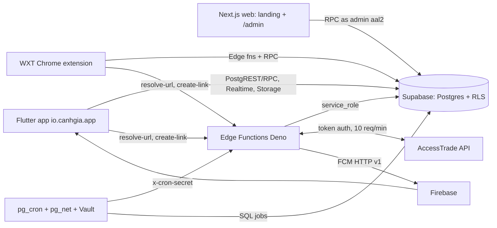
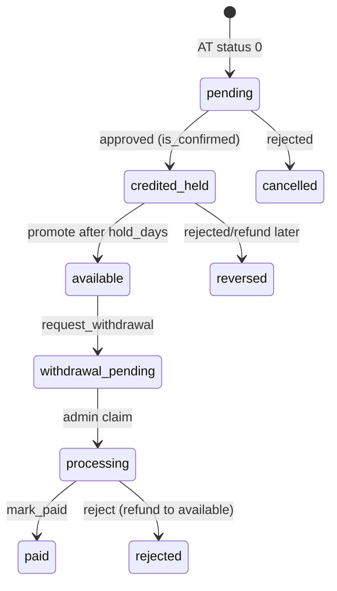

# System architecture

Source of truth = code: `supabase/migrations/`, `supabase/functions/`. Contracts index: `backend-contracts.md`.

## Components

| Part | Path | Notes |
|---|---|---|
| Mobile | `apps/mobile` | Flutter 3.47, Riverpod, go_router, supabase_flutter. Android = release gate, iOS best-effort. `docs/mobile-conventions.md` |
| Web | `apps/web` | Next.js: public landing, `/chinh-sach-bao-mat`, `/.well-known/{assetlinks.json,apple-app-site-association}` (env-driven), `/admin/*` (6 pages + login/mfa). `docs/web-admin-conventions.md` |
| Extension | `apps/extension` | WXT MV3. Bar injected on Shopee/Lazada/Tiki/TikTok only; Agoda/Traveloka/Klook popup-activate (optional host perms). QR-pair login |
| Backend | `supabase/` | 27 migrations, 8 Edge Functions, 13 cron jobs, buckets `kyc` + `complaints` (private, 5 MiB, jpeg/png) |
| Realtime | publication | `wallets, orders, notifications, withdrawals` |

## Money model (held -> available)
- Money = `bigint` VND, rates = bps. Money logic only in SQL (one transaction, row locks). Clients/Edge never compute balances.
- `wallets`: `pending_vnd`, `held_vnd`, `available_vnd`, `total_earned_vnd`. `wallet_ledger` immutable; positive rows carry `held_remaining` + `available_at`.
- AT conversion (status 0 pending, 1 approved, 2 rejected) -> `private.ingest_one` -> `orders` (`credit_state` none/pending/credited/cancelled/reversed) -> `apply_order_ledger` posts the delta between target (credited cashback) and ledger sum, so flip-flops and commission edits are idempotent.
- Credit lands in `held`. Cron `promote` (daily) moves rows past `available_at` (merchant `hold_days`, default 30, Tiki 45) from held to available. Reversal consumes `held_remaining` oldest-first, rest from available.
- Cashback = commission x user share; VIP bonus = share of commission (`vip_tiers.bonus_bps` 0/500/1000/2000); referral bonus = min(`referral_bonus_vnd`, 30% commission, commission - user cashback).
- Withdrawal: `request_withdrawal` needs `pin_token` (issued by `verify_pin`, 60 s, single use) + `request_key` (idempotent) + verified KYC + verified bank + daily cap + no active hold. Status `pending -> processing -> paid | rejected`. Admin claims (`admin_claim_withdrawal`), pays manually via VietQR (web generates QR locally), `admin_mark_paid` with unique `transfer_ref`. Auto payout = stub (`auto_payout_enabled`, no consumer).
- `check_wallet_drift()` compares wallets to ledger; cron `drift` notifies admins.

## Attribution
1. `create-link` inserts `clicks` row, builds AT link with `utm_source=canhgia`, `utm_content=u<profiles.short_id>c<click_id>`, `sub1=<click_id>`, `utm_medium=<app|extension>`. TikTok Shop uses v2 `create_link` (Product Link tab links are not tracked).
2. `sync-transactions` pulls conversions. Rows lacking a valid `utm_content` but with numeric `sub1` (also `_extra.sub1`) are rebuilt from `clicks` (`withSub1Fallback`). AT round-trip of `utm_content` is UNVERIFIED until a real order (see deployment-guide go-live).
3. `private.match_utm` requires regex `^u(\d+)c(\d+)$`, click owned by that user and same merchant. No match -> order inserted with `user_id null` (unmatched queue, admin assigns via `admin_assign_order`).
4. Manual claims (`submit_missing_order`, `KN-xxxxxx`) attach to a later AT row by normalized `transaction_id`; conflicting owner -> `order_claim_conflict` fraud flag, no silent reassignment.

## Sync + cron (UTC; ICT = +7; migration `20261002000100_cron_jobs.sql`)
| Job | Schedule | Action |
|---|---|---|
| tx-recent / tx-older | */20 min / :10 every 6 h | `sync-transactions` window recent/older |
| datafeeds-backfill | */10 min | `sync-datafeeds` backfill (no-op once every datafeed merchant is done) |
| datafeeds-delta | */10 min, 19-22h | `sync-datafeeds` delta; then `assign_product_groups`, `evaluate_price_alerts` |
| campaigns / vouchers | 18:00 daily / :15 every 6 h | `sync-catalog` |
| push-drain | every minute | `send-push` (FCM) |
| risk / vip / promote | :05 hourly / 17:30 / 17:00 | `refresh_risk_scores`, `refresh_vip_tiers`, `promote_withdrawable` |
| drift | 17:45 | wallet vs ledger, notify admins |
| purge-ext-login / retention | */30 min / Sun 20:00 | delete expired QR codes; price_snapshots > 400 d, sync_errors > 90 d |
`private.invoke_edge` reads Vault `project_url` + `cron_secret`; missing -> writes `sync_state.last_error='vault_missing'` and no-ops. AT calls share a token-bucket per endpoint (`at_rate_limit_take`, capacity 5, refill 10/min) so cron + user calls stay under 10 req/min.

## Security model
- RLS on every table. `authenticated` reads only own rows; column-level SELECT grants hide `commission_vnd`, `user_share_bps`, `vip_bonus_bps` (orders), `risk_level, claimed_by, paid_by` (withdrawals), `created_by, held_remaining` (ledger). Clients list columns, never `select *` there. Admin UI reads views `admin_orders`, `admin_withdrawals`.
- Writes only via `security definer` RPC with pinned `search_path`; service fns granted to `service_role` only. Error vocabulary = raised message code (`backend-contracts.md`).
- Admin = row in `public.admins` AND JWT `aal2` (TOTP). `is_admin()` always requires aal2; `is_admin_candidate()` (row only) allows the enrol gate. Every `admin_*` RPC goes through `private.admin_gate` and writes `admin_audit_log` (`admin_log_action` for exports/KYC views). Refunds > 2.000.000 d need a second approver.
- PIN: 6 digits, hashed server side, lockout (`pin_locked`), token single use. Biometric vault on device is a convenience gate only.
- CCCD: last 4 digits + HMAC (pepper in Vault `cccd_pepper`) + images in private bucket. KYC images viewed by admin are audited.
- Edge: user fns `verify_jwt=true`; cron fns `verify_jwt=false` + `x-cron-secret`; `extension-login` anon, code-only QR, client secret hashed (sha256), 2 min TTL, 24 h withdrawal hold after use, IP rate limit.
- Secrets: AT token, CRON_SECRET, FCM service account only in Edge secrets; service-role key never in Vercel, apps or extension. Turnstile on auth. Security headers in `src/lib/security-headers.ts`.
- Fraud: `fraud_flags` + `user_risk` (cron), device cap 10/user, referral/complaint caps, click limit per hour (`app_settings`).

## Data flows in one line each
- Login: Google native (mobile) / email OTP / Google web (admin uses OTP + TOTP) -> `profiles` trigger. Extension: QR pair with a signed-in app.
- Shopping: paste/share URL -> `resolve-url` -> `create-link` -> open aff link -> AT tracks -> sync -> order pending -> Realtime + push.
- Search/compare: datafeeds -> `offers` -> exact grouping (`product_groups`) -> `search_offers/get_compare/get_price_history`.
